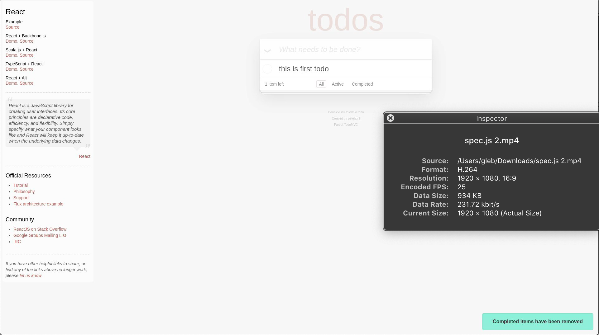
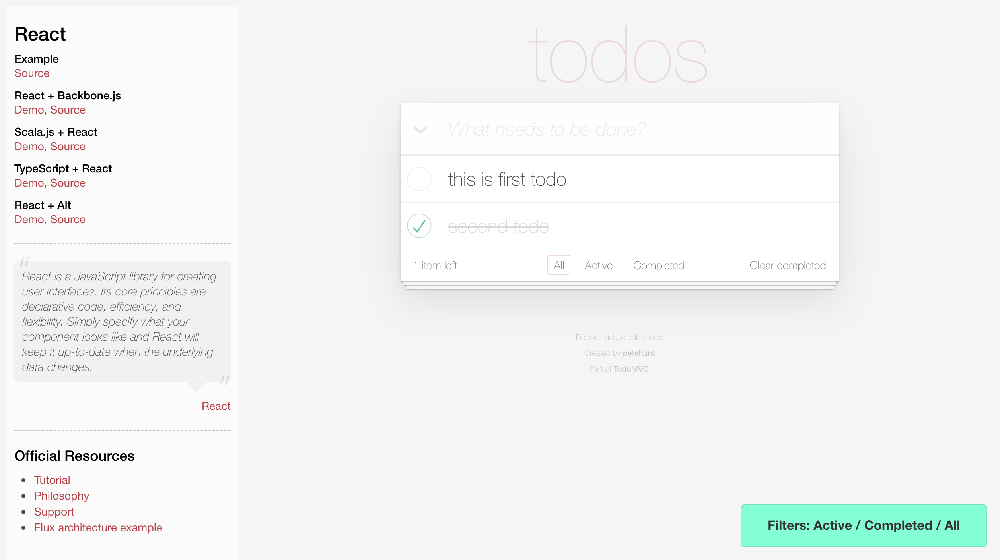

# cypress-movie [![ci status][ci image]][ci url] [![renovate-app badge][renovate-badge]][renovate-app] 

<!--
[](https://cloudsynth.com/tree-badges/r/01EJRHZHPB709P9DYCSR7FGHYJ)
-->

> Exploring how one can generate product demo videos from Cypress tests

Example capturing high resolution video of the test run with additional message pop ups (using [tiny-toast](https://github.com/bahmutov/tiny-toast) library injected on `cy.visit`)



The movies are generated at 1920x1080, the headless browser is set to the same size. The command log is hidden, thus the app takes the entire video. Here is a still from a movie generated on CI with its dimensions shown.

Related video: [WeAreDevs presentation](https://youtu.be/p38bIMC-YOU?t=1949) - start watching at minute 32. Presentation slides at [slides.com/bahmutov/e2e-in-the-future](https://slides.com/bahmutov/e2e-in-the-future).

## Install

Requires Node v10+

```shell
# using NPM
$ npm i -D cypress-movie
# using Yarn
$ yarn add -D cypress-movie
```

Now you should be able to use `cypress-movie` command, see [Movies](#movies)

This project requires native extensions to perform image resizing, thus in your project's `cypress.json` file should include

```json
{
  "nodeVersion": "system"
}
```

## Details

When using `cypress run` the headless browser is set to use 1920x1080 resolution from the [cypress/plugins/index.js](cypress/plugins/index.js) file. The viewport width and height are also set to the same values using the config object. During the test run, the Command Log is hidden before the test, see [cypress/support/index.js](cypress/support/index.js) file.

Thus, if you have Chrome browser installed, generate full movies in `cypress/videos`

```shell
npm run chrome
```

## Options

You can control the plugin via environment variables or `env` object inside [cypress.json](cypress.json) file.

```js
{
  "env": {
    "cypress-movie": {
      "enabled": true,
      "cursorTracking": {
        "enabled": false,
        "shape": "dot" // Valid values: "dot", "arrow"
      },
      "width": 1920,
      "height": 640
    }
  }
}
```

Note: these options change the _movie_ output, they do not disable individual commands.

## Commands

You can include these commands from the Cypress support file

```js
// cypress/support/index.js
import 'cypress-movie/commands'
```

### Toast

```js
// all parameters are optional
cy.toast('Filters: Active / Completed / All', {
  duration: 3000,
  blocking: true,
})
```



### Text

You can place a text at the bottom of the page

```javascript
// all parameters are optional
cy.text('This is some text', {
  duration: 2000, // how long the text should be there
  blocking: true, // wait for the text to hide
  textSize: '20pt', // CSS text height
})
```


See [cypress/integration/text-spec.js](cypress/integration/text-spec.js)

### Arrows

You can draw arrows to point at DOM elements using the child `cy.arrow()` command

```js
// all options are optional
cy.get('.new-todo').arrow({
  duration: 3000,
  blocking: true,
  pointAt: 'bottomLeft', // or "bottomRight"
  offsetX: 0, // move the tip by X pixels
  offsetY: 0, // move the tip by Y pixels
  strokeWidth: 5 // SVG line width, pixels
  color: 'orange', // color name or hex string like "#ff00ff"
})
```

You can add a text label to the arrow

```js
cy.get('.new-todo').arrow({
  text: 'Completed todos only',
  textSize: '5vh',
})
```


See [cypress/integration/arrow-spec.js](cypress/integration/arrow-spec.js) for examples

### cy.screenshot

This module overwrites [cy.screenshot](https://on.cypress.io/screenshot) command. If you are using `cy.screenshot(..., {capture: 'viewport'})` with headless Chrome, then Chrome Debugger Protocol will be used to take the full resolution screenshot. You can resize the output image while preserving the aspect ratio by adding an optional `maxWidth` parameter.

```js
cy.screenshot('finish', { capture: 'viewport', maxWidth: 800 })
```

See [cypress/integration/screenshot-spec.js](cypress/integration/screenshot-spec.js) for example.

## Continuous Integration

I could reliably generate 1920x1080 movies on CI only by using headless Chrome browser. For example see [GitHub Actions ci.yml](.github/workflows/ci.yml) file.

## Feedback

If you have ideas in what directions this could go - please open an issue in this repo. I would love to hear them.

## Debugging

Run project with `DEBUG=cypress-movie` environment variable to see verbose debug logs

## Movies

You can record an individual test into a Gif or an MP4 file. Run all tests or a single spec using `cypress-movie` command; it will run all tests, but will extract every test if its title contains the `🎥` emoji.

```
npx cypress-movie
# or use --spec name or wildcard pattern
npx cypress-movie --spec cypress/integration/my-spec.js
npx cypress-movie --spec 'cypress/integration/movies*-spec.js'
```

The individual movies will be saved in "cypress/movies" folder.

Example gif from [cypress/integration/arrow-spec.js](cypress/integration/arrow-spec.js)


Only the test itself is captured, without any hooks.

## Arguments

You can pass a few arguments to control the output GIF

```shell
npx cypress-movie --width 640 --fps 30 --format gif
# --width is the output gif resolution, pixels
#     height will be set automatically to preserve the aspect ratio
#     default 960
# --fps is frames per second in the output gif
#     default 10
# --format is gif or mp4
#     default gif
# --browser is browser binary path or name like "chrome", "firefox", "electron"
#     default chrome
```

### Small print

Author: Gleb Bahmutov &lt;gleb.bahmutov@gmail.com&gt; &copy; 2017

- [@bahmutov](https://twitter.com/bahmutov)
- [glebbahmutov.com](https://glebbahmutov.com)
- [blog](https://glebbahmutov.com/blog)

License: MIT - do anything with the code, but don't blame me if it does not work.

[ci image]: https://github.com/bahmutov/cypress-movie/workflows/ci/badge.svg?branch=master
[ci url]: https://github.com/bahmutov/cypress-movie/actions
[renovate-badge]: https://img.shields.io/badge/renovate-app-blue.svg
[renovate-app]: https://renovateapp.com/
