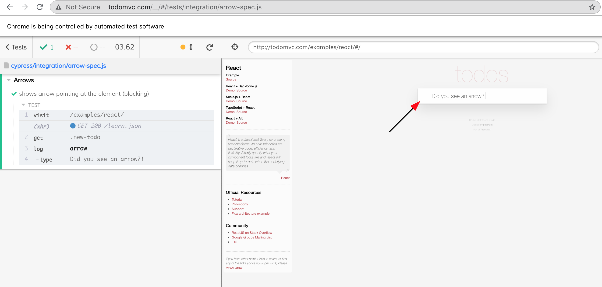

# cypress-movie [![ci status][ci image]][ci url] [![renovate-app badge][renovate-badge]][renovate-app]

> Exploring how one can generate product demo videos from Cypress tests

Example capturing high resolution video of the test run with additional message pop ups (using [tiny-toast](https://github.com/bahmutov/tiny-toast) library injected on `cy.visit`)


The movies are generated at 1920x1080, the headless browser is set to the same size. The command log is hidden, thus the app takes the entire video. Here is a still from a movie generated on CI with its dimensions shown.

Related video: [WeAreDevs presentation](https://youtu.be/p38bIMC-YOU?t=1949) - start watching at minute 32. Presentation slides at [slides.com/bahmutov/e2e-in-the-future](https://slides.com/bahmutov/e2e-in-the-future).

## Details

When using `cypress run` the headless browser is set to use 1920x1080 resolution from the [cypress/plugins/index.js](cypress/plugins/index.js) file. The viewport width and height are also set to the same values using the config object. During the test run, the Command Log is hidden before the test, see [cypress/support/index.js](cypress/support/index.js) file.

Thus, if you have Chrome browser installed, generate full movies in `cypress/videos`

```shell
npm run chrome
```

## Commands

You can include these commands from the Cypress support file

```js
// cypress/support/index.js
import 'cypress-movie/commands'
```

### Arrows

You can draw arrows to point at DOM elements using the child `cy.arrow()` command

```jsx
// all options are optional
cy.get('.new-todo').arrow({
  duration: 3000,
  blocking: true,
  pointAt: 'bottomLeft', // or "bottomRight"
  offsetX: 0, // move the tip by X pixels
  offsetY: 0, // move the tip by Y pixels
  strokeWidth: 5 // SVG line width, pixels
  color: 'orange', // color name or hex string like "#ff00ff"
})
```



See [cypress/integration/arrow-spec.js](cypress/integration/arrow-spec.js) for examples

## Continuous Integration

I could reliably generate 1920x1080 movies on CI only by using headless Chrome browser. For example see [GitHub Actions ci.yml](.github/workflows/ci.yml) file.

## Feedback

If you have ideas in what directions this could go - please open an issue in this repo. I would love to hear them.

## Debugging

Run project with `DEBUG=cypress-movie` environment variable to see verbose debug logs

## Gif

You can convert a test if its title contains `🎥` emoji into a Gif.

```
npx cypress-movie
# or use --spec name or wildcard pattern
npx cypress-movie --spec cypress/integration/my-spec.js
npx cypress-movie --spec 'cypress/integration/movies*-spec.js'
```

The individual movies will be saved in "cypress/movies" folder.

Example gif from [cypress/integration/arrow-spec.js](cypress/integration/arrow-spec.js)


Only the test itself is captured, without any hooks.

### Trimming video file

Trying the following command: not working

```
./node_modules/@ffmpeg-installer/darwin-x64/ffmpeg -i cypress/videos/gif-spec.js.mp4 -c copy -ss 00:00:1 -t 00:00:3 -y out.mp4
```

Got success with NOT passing codecs

```
./node_modules/@ffmpeg-installer/darwin-x64/ffmpeg -i cypress/videos/gif-spec.js.mp4 -ss 00:00:4.285 -t 00:00:5.950 -y out.mp4
```

The timestamps like `-ss` and `-t` are specified using `HH:MM:SS.xyz` format where `.xyz` are milliseconds.

With scaling output. The original video is 1920x1080 which is 16:9 we can output small demo loops of 960x540, but we can specify a single dimension and let the ffmpeg compute the other one. Also let's specify

```
./node_modules/@ffmpeg-installer/darwin-x64/ffmpeg -i cypress/videos/gif-spec.js.mp4 -ss 00:00:4.285 -t 00:00:5.950 -y -vf scale=960:-1:flags=lanczos out.mp4
```

See [scaling docs](https://ffmpeg.org/ffmpeg-scaler.html)

### Converting MP4 to GIF

Following https://superuser.com/questions/556029/how-do-i-convert-a-video-to-gif-using-ffmpeg-with-reasonable-quality

```
./node_modules/@ffmpeg-installer/darwin-x64/ffmpeg -i cypress/videos/gif-spec.js.mp4 -ss 00:00:4.285 -t 00:00:5.950 -y -vf "fps=10,scale=960:-1:flags=lanczos,split[s0][s1];[s0]palettegen[p];[s1][p]paletteuse" -loop 0 out.gif
```

### Small print

Author: Gleb Bahmutov &lt;gleb.bahmutov@gmail.com&gt; &copy; 2017

- [@bahmutov](https://twitter.com/bahmutov)
- [glebbahmutov.com](https://glebbahmutov.com)
- [blog](https://glebbahmutov.com/blog)

License: MIT - do anything with the code, but don't blame me if it does not work.

[ci image]: https://github.com/bahmutov/cypress-movie/workflows/ci/badge.svg?branch=master
[ci url]: https://github.com/bahmutov/cypress-movie/actions
[renovate-badge]: https://img.shields.io/badge/renovate-app-blue.svg
[renovate-app]: https://renovateapp.com/
